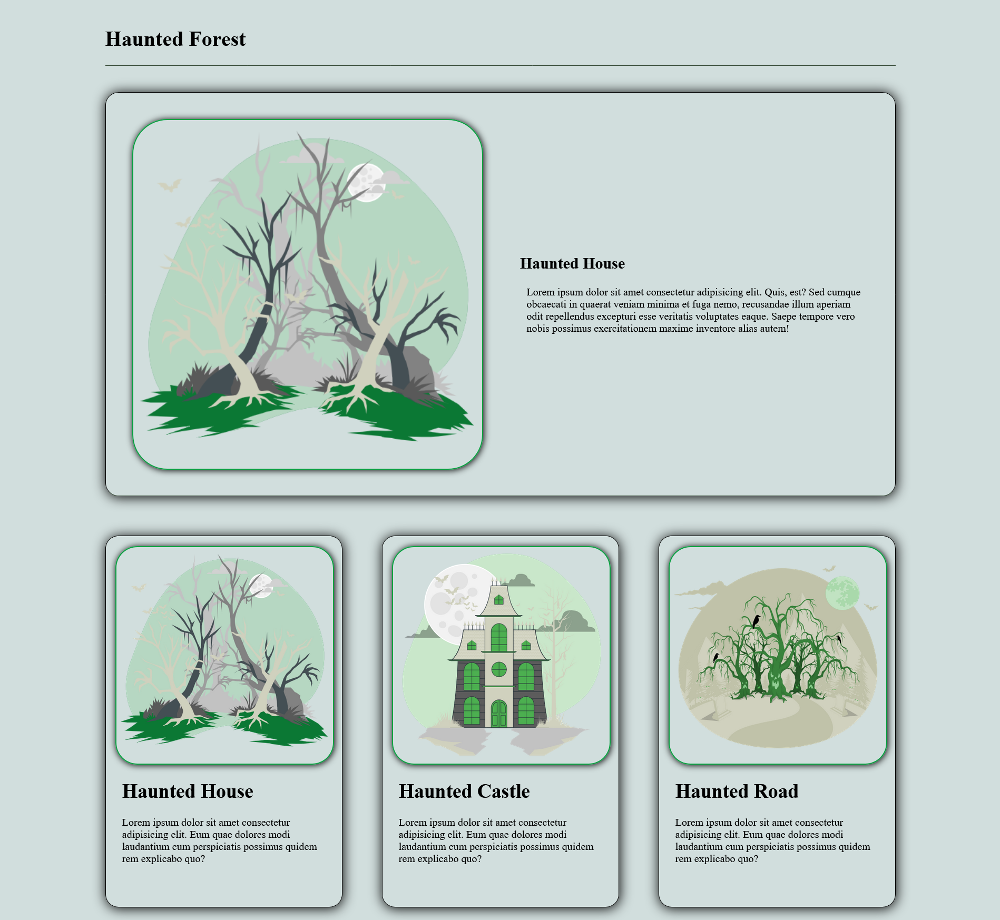

# 🌲 Haunted Forest

Haunted Forest یک قالب وب مدرن با تم ترسناک و ماجراجویانه است که با استفاده از HTML5 و CSS3 توسعه داده شده است. این پروژه با بهره‌گیری از CSS Grid، CSS Variables و افکت‌های تعاملی، محیطی جذاب برای نمایش مکان‌ها، داستان‌ها یا محتوای مرتبط با دنیای ترس و فانتزی ایجاد می‌کند.

## ✨ ویژگی‌های پروژه

* طراحی مدرن و الهام‌گرفته از فضای ترسناک
* پیاده‌سازی کامل با HTML5 و CSS3
* استفاده از CSS Grid Layout
* ساختار کاملاً واکنش‌گرا (Responsive)
* استفاده از CSS Variables برای مدیریت آسان استایل‌ها
* افکت Hover روی تصاویر
* انیمیشن نمایش دکمه‌ها هنگام Hover
* کارت‌های محتوایی با سایه و جلوه‌های بصری
* طراحی ماژولار و قابل توسعه
* مناسب برای صفحات معرفی، گالری و وبلاگ‌های موضوعی

## 🛠️ تکنولوژی‌های استفاده شده

* HTML5
* CSS3
* CSS Grid
* CSS Variables
* Media Queries
* CSS Transitions

## 📂 ساختار صفحات

### Header

* عنوان اصلی وب‌سایت
* طراحی مینیمال با تم جنگل ترسناک

### Featured Section

* معرفی بخش اصلی پروژه
* تصویر شاخص
* توضیحات کامل درباره محتوای اصلی

### Content Cards

* Haunted House
* Haunted Castle
* Haunted Road

هر کارت شامل:

* تصویر اختصاصی
* عنوان
* توضیحات
* دکمه مشاهده جزئیات

### Interactive Elements

* افکت بزرگ‌نمایی تصاویر
* تغییر رنگ عناوین هنگام Hover
* نمایش نرم دکمه "See More"

## 🎨 ویژگی‌های طراحی

### CSS Variables

برای مدیریت آسان رنگ‌ها و تنظیمات اصلی از متغیرهای CSS استفاده شده است:

* رنگ پس‌زمینه
* حداکثر عرض صفحات
* رنگ متون
* شعاع گوشه تصاویر
* سایه‌ها
* خطوط جداکننده

### Hover Effects

* Zoom Effect روی تصاویر
* تغییر رنگ عناوین
* انیمیشن نمایش دکمه‌ها

### Layout

* طراحی سه ستونه در دسکتاپ
* بازچینی خودکار محتوا در تبلت و موبایل
* بخش ویژه (Featured Article) در عرض کامل صفحه

## 📱 قابلیت ریسپانسیو

پروژه برای نمایش در دستگاه‌های مختلف بهینه‌سازی شده است:

### Desktop

* نمایش سه ستونه
* استفاده کامل از CSS Grid

### Tablet

* تغییر ساختار کارت‌ها برای خوانایی بهتر

### Mobile

* تبدیل بخش اصلی به حالت ستونی
* بهبود تجربه کاربری در نمایشگرهای کوچک

## پیش نمایش 



## 🚀 نحوه اجرا

```bash
git clone https://github.com/Aref18/Haunted-Forest.git
```

سپس فایل `index.html` را در مرورگر اجرا کنید.

## 📚 مفاهیم تمرین شده

* CSS Grid Layout
* Responsive Web Design
* CSS Variables
* Hover Animations
* CSS Transitions
* Component-Based Layout Design
* Modern UI Design

## 🎯 هدف پروژه

هدف این پروژه تمرین طراحی رابط کاربری مدرن، کار با Grid Layout، استفاده از متغیرهای CSS و پیاده‌سازی افکت‌های تعاملی برای ایجاد یک تجربه کاربری جذاب بوده است.

---

Developed with ❤️ by Aref
